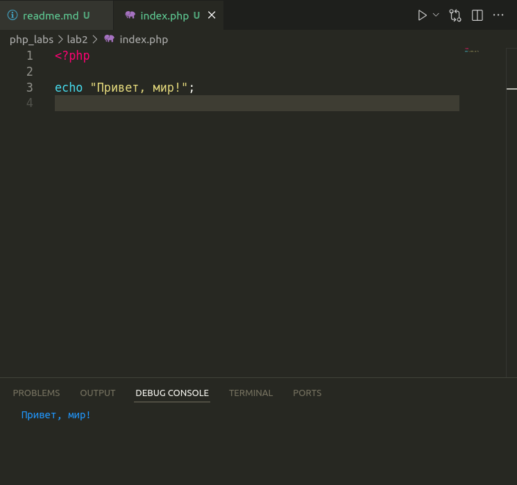
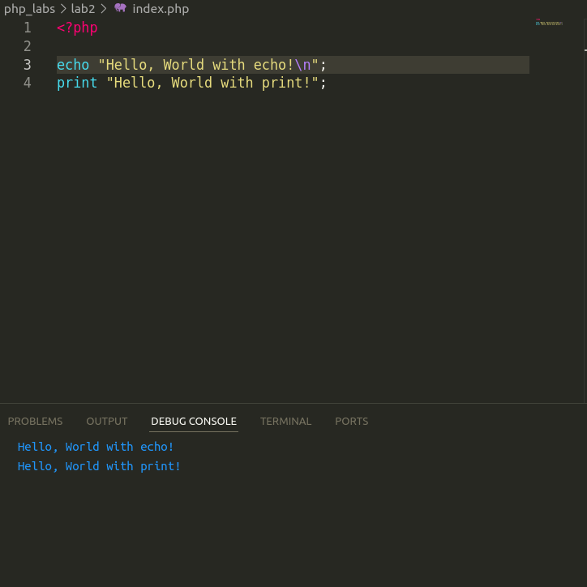
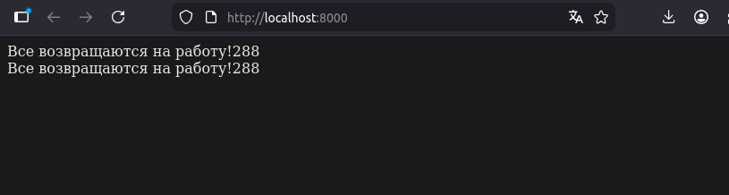

# Лабораторная работа №2. Основы PHP

## Выполнил - Анисимов Виктор IA2403

### Задание 1. Установка PHP

PHP пакет у меня уже был установлен. Но что бы его установить на NixOS, - моей операционной системе, можно  добавить название пакета PHP в блок необходимых пакетов для пользователя в файле конфигурации системы `/etc/nixos/configuration.nix`:
``` bash 
  environment.systemPackages = with pkgs; [
    #список пакетов
    php 
    #список пакетов...
  ];
```

Проверяем установлен ли PHP:

``` bash
~> php -v
PHP 8.4.16 (cli) (built: Dec 16 2025 16:03:34) (NTS)
Copyright (c) The PHP Group
Zend Engine v4.4.16, Copyright (c) Zend Technologies
    with Zend OPcache v8.4.16, Copyright (c), by Zend Technologies
```

### Задание 2. Первая программа на PHP

Запускает "Привет, мир!" на PHP:



### Задание 3. Вывод строк через `echo` и `print`

Запустим программу с выводом строк в консоль разными языковыми конструкциями:



Обе языковые конструкции выводят строку на HTML страницу (в нашем случае в консоль).

Результат одинаковый - так в чём же разница?

 - `echo` :
    - не возращает значение
    - может принимиать множество аргументов
    - быстрее на одну инструкцию
 - `print` :
    - возращает значение - всегда 1.
    - арность = 1
    - [медленнее на одну инструкцию (опкод) - возвращение значения](https://habr.com/ru/articles/211156/)

На практике же почти всегда используют `echo`.
Одна из причин: не нужно конкатинировать строки для вывода через `print`. 
В редких случая можно использовать `print` в пользу возвращаемого значения (например в тернарном операторе)

### Задание 4. Работа с переменными

Выведем конкатинацию двух переменных разными способами:

``` php
<?php

$days = 288;
$message = "Все возвращаются на работу!";

echo $message . $days;

echo "\n\n{$message}{$days}";
```

Необходимо было использовать \<br/\>, - нужно поднять локальный сайт.

Создаю базовую html страницу с использованием php:
``` php
<!DOCTYPE html>
<html lang="en">
<head>
    <meta charset="UTF-8">
    <meta name="viewport" content="width=device-width, initial-scale=1.0">
    <title>Document</title>
</head>
<body>
    <?php

        $days = 288;
        $message = "Все возвращаются на работу!";

        echo $message . $days;
    ?>
    
    <br/>
    
    <?php
        echo "{$message}{$days}";
    ?>
</body>
</html>
```

Выполняю команду в папке с `index.php`
```bash
php -S localhost:8000
```

Параметр `-S` означает запустить в строеным сервером по указанному адресу и порту.

После, перехожу на url `http://localhost:8000/index.php` и вижу вывод:



### Контрольные вопросы

1. Какие способы установки PHP существуют?
    - Через различные пакетные менеджеры, такие как `apt`, `dfn`, `pacman`, `brew`, `nix` и т.д.
    - Добавить название пакеты в зависимости ОС, как у меня.
    - Установка из исходников - скачивание официального tar.gz. После  - `make install`.
    - Использовать PHP в контейнере с помощью образа.
2. Как проверить, что PHP установлен и работает?
    
    Просто выполните команду 
    ``` bash
    php -v
    ```

    Если видите версию и другие подробности тогда PHP установлен.

3. Отличия `echo` и `print` уже были описаны в работе [здесь](#задание-3-вывод-строк-через-echo-и-print).


