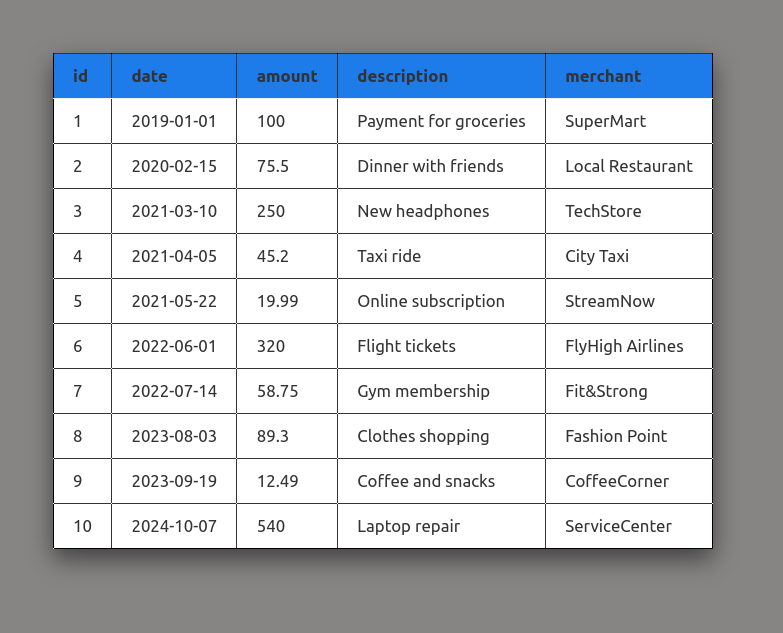

# Лабораторная работа №4.Массивы и Функции

## Выполнил - Анисимов Виктор IA2403

### Задание 1. Работа с массивами

Первым делом проверим версию php - она должна быть больше 8. 

``` bash
$ php -v
PHP 8.4.16 (cli) (built: Dec 16 2025 16:03:34) (NTS)
Copyright (c) The PHP Group
Zend Engine v4.4.16, Copyright (c) Zend Technologies
    with Zend OPcache v8.4.16, Copyright (c), by Zend Technologies
```

Да - версия подходит.

Создаём файл `index.php`, в нём включаем строгую типизацию.

### Задание 1.2. Создание массива транзакций

Необходимо создать массив транзаций для дальнейшей работы с ним.

``` php
$transactions = [
    'id' = ,
    'date' = ,
    'amount' = ,
    'description' = ,
    'merchant' =
]
```

Я сгенерировал массив из 10 транзакций. Поле **'date'** использую типа DateTime.

### Задание 1.3. Вывод списка транзакций

С помощью функций `show_header_table` и `show_body_table` вывожу красиво данные на страницу сайта: 



### Задание 1.4. Реализация функций

Необхоидмо реализовать список функции. Далее я опишу что делает каждая из них, покажу её реализацию, и как она работает.

1. **calculateTotalAmount** 
