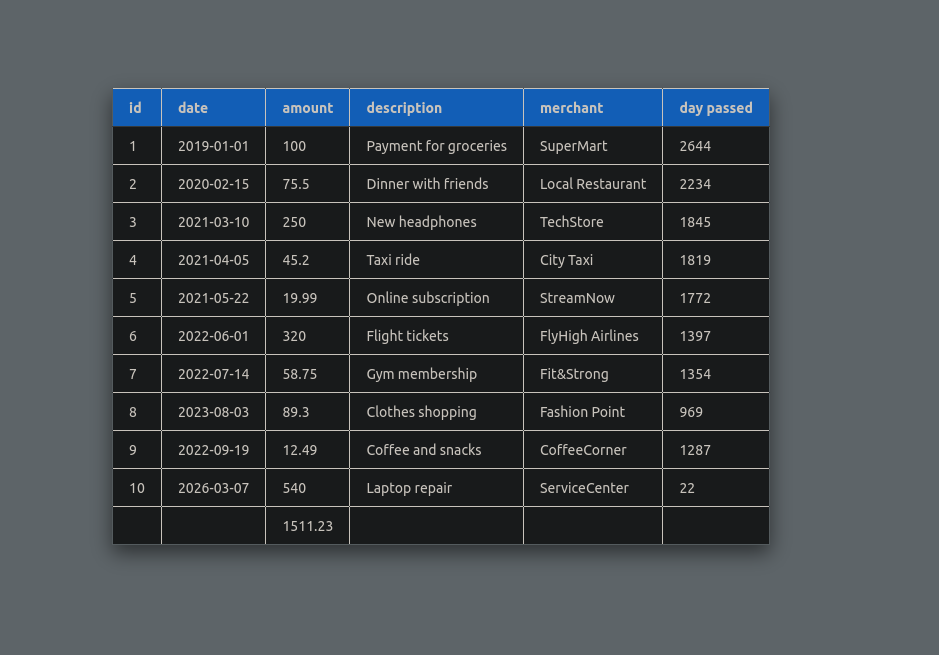
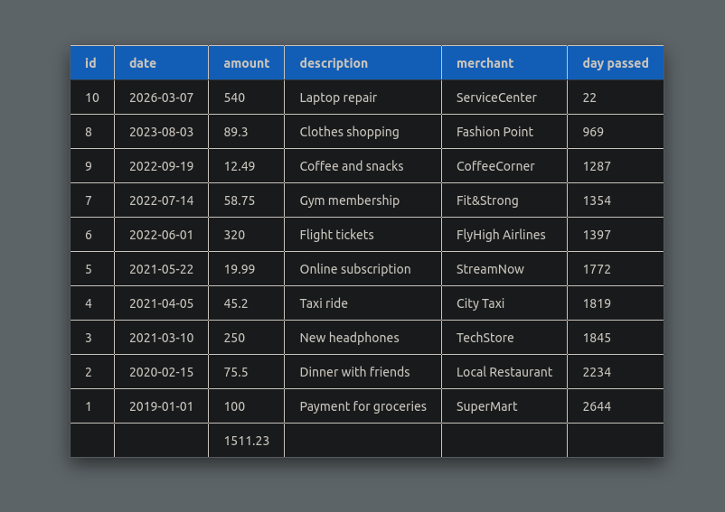
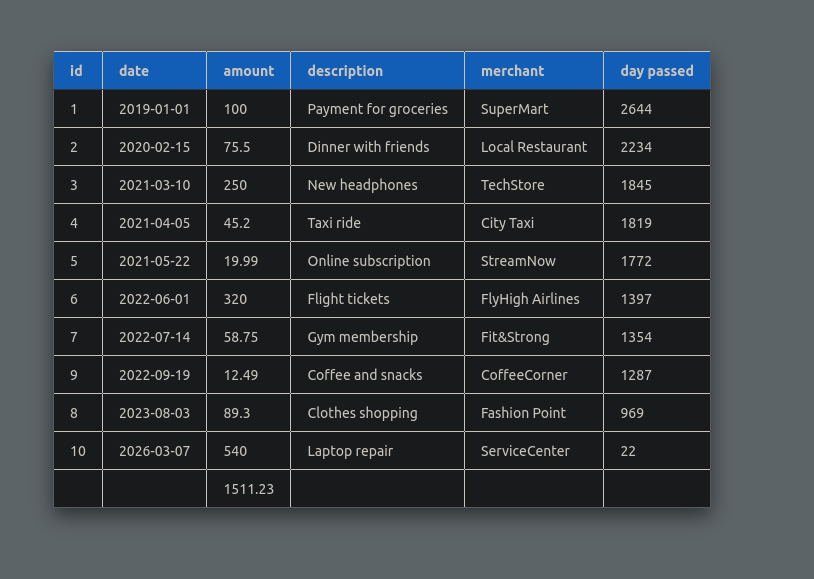
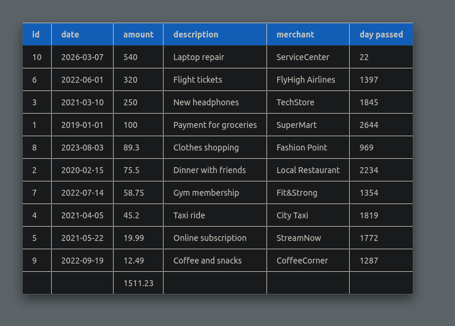
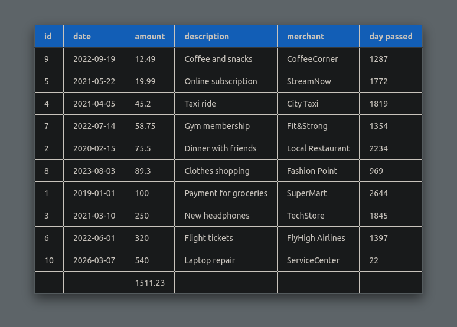

# Лабораторная работа №4.Массивы и Функции

## Выполнил - Анисимов Виктор IA2403

### Задание 1. Работа с массивами

Первым делом проверим версию php - она должна быть больше 8.

``` bash
$ php -v
PHP 8.4.16 (cli) (built: Dec 16 2025 16:03:34) (NTS)
Copyright (c) The PHP Group
Zend Engine v4.4.16, Copyright (c) Zend Technologies
    with Zend OPcache v8.4.16, Copyright (c), by Zend Technologies
```

Да - версия подходит.

Создаём файл `index.php`, в нём включаем строгую типизацию.

### Задание 1.2. Создание массива транзакций

Необходимо создать массив транзакций для дальнейшей работы с ним.

``` php
$transactions = [
    'id' = ,
    'date' = ,
    'amount' = ,
    'description' = ,
    'merchant' =
]
```

Я сгенерировал массив из 10 транзакций. Поле **'date'** использую типа DateTime.

### Задание 1.3. Вывод списка транзакций

С помощью функций `show_header_table` и `show_body_table` вывожу красиво данные на страницу сайта:



Реализация функции `show_header_table`:

```php
/**
 * Генерирует строку с заголовком таблицы на основе ключей первой транзакции.
 *
 * @param array $transaction ассоциативный массив одной транзакции (например, $transactions[0])
 * @return string HTML-строка с <tr> и <th> для каждого ключа, плюс столбец "day passed"
 */
function show_header_table(array $transaction): string
{
    $result = "<tr>\n";
    foreach (array_keys($transaction) as $key) {
        $result .= "<th>" . $key . "</th>\n";
    }

    $result .= "<th>day passed</th>";

    $result .= "</tr>\n";
    return $result;
}
```

Реализация функции `show_body_table`:

```php
/**
 * Генерирует тело таблицы для всех транзакций, добавляя столбец "дней прошло".
 *
 * @param array $transactions массив транзакций, каждая — ассоциативный массив
 * @return string HTML-строка с сериями <tr> и <td> для всех транзакций
 */
function show_body_table(array $transactions): string
{
    $result = "";

    $dayPassed = daysSinceTransaction(new DateTime());
    $idx = 0;

    foreach ($transactions as $t) {
        $t["date"] = $t["date"]->format("Y-m-d");

        $result .= "<tr>\n";

        foreach ($t as $value) {
            $result .= "\t<td>" . $value . "</td>\n";
        }

        $result .= "\t<td>" . $dayPassed[$idx++] . "</td>\n";
        $result .= "<tr>\n";
    }
    return $result;
}
```

### Задание 1.4. Реализация функций

Необходимо реализовать список функции. Далее я опишу что делает каждая из них и покажу её реализацию.

1. **calculateTotalAmount**

    ```php
    /**
     * Считает общую сумму поля 'amount' по всем транзакциям.
     *
     * @param array $transactions массив транзакций, каждая — ассоциативный массив с ключом 'amount'
     * @return float общая сумма всех amount
     */
    function calculateTotalAmount(array $transactions): float
    {
        return array_sum(array_column($transactions, 'amount'));
    }
    ```

2. **findTransactionsByDescription**

    ```php
    /**
     * Находит все транзакции, в описании которых встречается заданная подстрока.
     * Использует глобальный массив $transactions.
     *
     * @param string $descriptionPart подстрока, которую ищем в поле 'description' транзакции
     * @return array массив отфильтрованных транзакций, удовлетворяющих условию
     */
    function findTransactionsByDescription(string $descriptionPart): array
    {
        global $transactions;
        return array_filter($transactions, fn($t) => str_contains($t['description'], $descriptionPart));
    }
    ```

    **Пример использования** \
    Код:

    ```php
    <?php
    include __DIR__ . '/transactions.php';
    require __DIR__ . '/functions.php';
    $findTransactions = findTransactionsByDescription("Laptop");

    var_dump($findTransactions); 
    ```

    Вывод:

    ```bash
    > php demonstration.php

    array(1) {
    [9]=>
    array(5) {
        ["id"]=>
        int(10)
        ["date"]=>
        object(DateTime)#10 (3) {
        ["date"]=>
        string(26) "2026-03-07 00:00:00.000000"
        ["timezone_type"]=>
        int(3)
        ["timezone"]=>
        string(3) "UTC"
        }
        ["amount"]=>
        float(540)
        ["description"]=>
        string(13) "Laptop repair"
        ["merchant"]=>
        string(13) "ServiceCenter"
    }
    }
    ```

3. **findTransactionById**

    ```php
    /**
     * Находит все транзакции с заданным id.
     * Использует глобальный массив $transactions.
     *
     * @param int $id идентификатор транзакции, который нужно найти
     * @return array массив транзакций с указанным id (может быть 0 или несколько элементов)
     */
    function findTransactionById(int $id): array
    {
        global $transactions;
        return array_filter($transactions, fn($t) => $t["id"] == $id);
    }
    ```

    **Пример использования** \
    Код:

    ```php
    <?php
    include __DIR__ . '/transactions.php';
    require __DIR__ . '/functions.php';

    $findTran = findTransactionById(8);

    var_dump($findTran); 
    ```

    Вывод:

    ```bash
    > php demonstration.php
    array(1) {
    [7]=>
    array(5) {
        ["id"]=>
        int(8)
        ["date"]=>
        object(DateTime)#8 (3) {
        ["date"]=>
        string(26) "2023-08-03 00:00:00.000000"
        ["timezone_type"]=>
        int(3)
        ["timezone"]=>
        string(3) "UTC"
        }
        ["amount"]=>
        float(89.3)
        ["description"]=>
        string(16) "Clothes shopping"
        ["merchant"]=>
        string(13) "Fashion Point"
    }
    }
    ```

4. **daysSinceTransaction**

    ```php
    /**
     * Для каждой транзакции возвращает количество дней между заданной датой и датой транзакции.
     * Использует глобальный массив $transactions.
     *
     * @param DateTime $date дата, относительно которой считать дни
     * @return array массив целых чисел, где каждый элемент — количество дней для соответствующей транзакции
     */
    function daysSinceTransaction(DateTime $date): array
    {
        global $transactions;
        return array_map(fn($t) => ($date->diff($t["date"]))->days, $transactions);
    }
    ```

5. **addTransaction**

    ```php
    /**
     * Добавляет новую транзакцию в глобальный массив $transactions.
     *
     * @param int $id идентификатор транзакции
     * @param DateTime $date дата транзакции
     * @param float $amount сумма транзакции
     * @param string $description краткое описание транзакции
     * @param string $merchant имя магазина/сервиса
     * @return void
     */
    function addTransaction(int $id, DateTime $date, float $amount, string $description, string $merchant): void
    {
        global $transactions;
        $transactions[] = [
            "id" => $id,
            "date" => $date,
            "amount" => $amount,
            "description" => $description,
            "merchant" => $merchant,
        ];
    }
    ```

    **Пример использования** \
    Код:

    ```php
    <?php
    include __DIR__ . '/transactions.php';
    require __DIR__ . '/functions.php';

    addTransaction(11, new DateTime(), 999, "some desc", "MYSELF");

    var_dump($transactions[10]);
    ```

    Вывод:

    ```bash
    > php demonstration.php
    array(5) {
    ["id"]=>
    int(11)
    ["date"]=>
    object(DateTime)#11 (3) {
        ["date"]=>
        string(26) "2026-03-02 13:21:23.554172"
        ["timezone_type"]=>
        int(3)
        ["timezone"]=>
        string(3) "UTC"
    }
    ["amount"]=>
    float(999)
    ["description"]=>
    string(9) "some desc"
    ["merchant"]=>
    string(6) "MYSELF"
    }
    ```

6. **sortByDate**

    ```php
    /**
     * Сортирует массив транзакций по дате.
     *
     * @param array $transactions массив транзакций (будет отсортирован по значению поля 'date')
     * @param bool $newFirst если true, сортирует по дате от новых к старым; если false — от старых к новым
     * @return array новый массив, отсортированный транзакций по дате
     */
    function sortByDate(array $transactions, bool $newFirst = true): array
    {
        $cond = fn($a, $b) => $newFirst ? $b <=> $a : $a <=> $b;

        usort($transactions, fn($a, $b) => $cond($a['date'], $b['date']));

        return $transactions;
    }
    ```

    **Пример использования**
    - От новых к старым:
        
    - От старых к новым:
        

7. **sortByAmount**

    ```php
    /**
     * Сортирует массив транзакций по сумме.
     *
     * @param array $transactions массив транзакций (будет отсортирован по значению поля 'amount')
     * @param bool $desc если true, сортирует по сумме от крупных к маленьким; если false — от маленьких к крупным
     * @return array новый массив, отсортированный транзакций по сумме
     */
    function sortByAmount(array $transactions, bool $desc = true): array
    {
        $cond = fn($a, $b) => $desc ? $b <=> $a : $a <=> $b;

        usort($transactions, fn($a, $b) => $cond($a['amount'], $b['amount']));

        return $transactions;
    }
    ```

    **Пример использования**
    - По убыванию:
        
    - По возрастанию:
        

### Задание 2 Работа с файловой системой

Создал `index.php`, рядом с ним создал папку, в которой сохранил несколько красивых фото из Minecraft.

```php
/**
 * Выводит список div-ов с классом `photo-card` Для всех элементов из папки images. 
 *
 * @param string $dir - путь до папки, из которой будут взяты файлы (например "path/to/images/").
 * @return string HTML разметка.
 */
function printImages(string $dir = "images/"): string
{
    $files = scandir($dir);
    if ($files === false) {
        return "<h2>ERROR 500</h2><br>Directory not found.";
    }

    $result = "<div class=\"photo-grid\">";

    for ($i = 0; $i < count($files); $i++) {
        if (($files[$i] != ".") && ($files[$i] != "..")) {
            $path = $dir . $files[$i];
            $result .= "<div class=\"photo-card\">\n";
            $result .= "\t\n";
            $result .= "</div>\n";
        }
    }

    $result.="</div>";
    return $result;
}
```

Страница имеет следующую HTML разметку:

```html
<body>

    <header>
        <h1>MY GALLERY</h1>
        <p><a href="https://www.minecraft.net/en-us/articles">Minecraft News</a></p>
    </header>

    <main>
        <?= printImages() ?>    
    </main>

    <footer>
        &copy; 2026 Minimalist Concept USM
    </footer>

</body>
```

Сама страница:


### Контрольные вопросы

1. Что такое массивы в PHP?

    Массивы — упорядоченная структура данных, связывающая ключи и значения, которая может использоваться как список, хеш-таблица или коллекция.

2. Каким образом можно создать массив в PHP?

    Массивы создаются функцией `array()` или коротким синтаксисом `[]`: `$arr = array(1, 2, 3);` или `$arr = [1, 2, 3];`.

3. Для чего используется цикл foreach?

    `foreach` используется для перебора всех элементов массива: `foreach($arr as $value)` или `foreach($arr as $key => $value)`.
