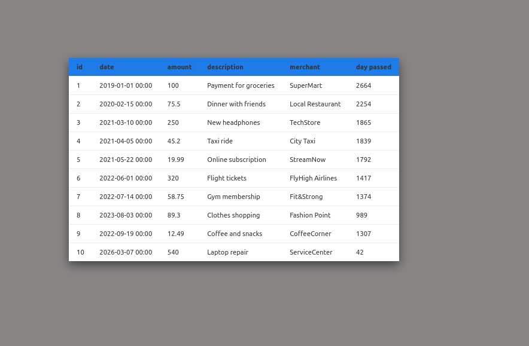

# Лабораторная работа №5 Объектно-ориентированное программирование в PHP

## Выполнил - Анисимов Виктор IA2403

## Цель работы

Освоить основы объектно-ориентированного программирования в PHP на практике. Научиться создавать собственные классы, использовать инкапсуляцию для защиты данных, разделять ответственность между классами, а также применять интерфейсы для построения гибкой архитектуры приложения.

## Кратко по реализации классов

- `Transaction` - объект доменной модели, хранит данные одной транзакции и предоставляет геттеры. Метод `getDaysSinceTransaction()` позволяет вывести в таблице «сколько дней прошло».
- `TransactionStorageInterface` - контракт для хранилища транзакций. Благодаря интерфейсу класс менеджера можно подключить к любому источнику данных (массив, БД, API) без изменения бизнес-логики.
- `TransactionRepository` - текущее in-memory хранилище. Отвечает за добавление, удаление, поиск по `id` и выдачу полного списка транзакций.
- `TransactionManager` - слой бизнес-логики: подсчеты сумм, фильтрация по диапазону дат, сортировки и подсчеты по мерчанту.
- `TransactionTableRenderer` - слой представления, который превращает массив объектов `Transaction` в HTML-таблицу для вывода на странице.



## Ответы на вопросы

1. Зачем нужна строгая типизация в PHP и как она помогает при разработке?
    Строгая типизация помогает в правильном построении логики, не упуская назначений переменных и методов. Разработчик во время написания не будет путаться между типами, а разработчик при просмотре кода легче его поймёт из-за указанных типов - что увидеть легче и быстрее, чем после прочтения документации к коду/методу.

2. Что такое класс в объектно-ориентированном программировании и какие основные компоненты класса вы знаете?
    Класс в объектно‑ориентированном программировании - это пользовательский тип данных, который объединяет данные (поля/свойства) и поведение (методы).
    Основные компоненты:
    - свойства (поля, состояния объекта),
    - методы (поведение объекта),
    - конструктор и деструктор (специальные методы для инициализации и очистки объекта, но не обязательные для всех классов).

3. Объясните, что такое полиморфизм и как он может быть реализован в PHP.
    Полиморфизм это способность разных объектов, функций или типов данных использовать один и тот же интерфейс или имя, но реализовывать их по-своему. Например, класс `Ястреб` и `Страус` реализуют один и тот же интерфейс `Птица`, но то, как они `двигаются` выполнено будет по разному.

    Пример кода на php:

    ``` php
    #/Bird.php
    <?php
    interface Bird{
        public function move();
    }
    
    #/Hawk.php
    class Hawk implements Bird{
        public function move(){
            # летать
        }
    }

    #/Ostrich.php
    class Ostrich implements Bird{
        public function move(){
            # бежать
        }
    }
    ```

    Таким образом становится намного легче работать с коллекциями разных классов, но которые наследуют один интерфейс.

4. Что такое интерфейс в PHP и как он отличается от абстрактного класса?
    Интерфейс это структура, содержащая объявления методов без их реализации, или с общей реализацией.
    Абстрактный класс это структура, содержащая описание для наследуемых классов - методы: как с реализацией так и без.

    Отличие от интерфейса в невозможности создать экземпляр абстрактного класса.

5. Какие преимущества дает использование интерфейсов при проектировании архитектуры приложения? Объясните на примере данной лабораторной работы.
    Преимущества заключаются в возможности комплексной обработки объектов реализующий один интерфейс. Так же есть возможность быстро создавать новый класс, реализующий тот же интерфейс - что никак не повлияет на исходный код приложения. Это увеличивает скорость разработки без изменения написанного кода.
    В данной работе класс `TransactionRepository` реализует интерфейс `TransactionStorageInterface`. Сегодня метод получение всех транзакции имеет одну реализацию - а завтра уже другую. Метод может быть изменён при этом не нужно будет менять основную логику построение таблицы.
